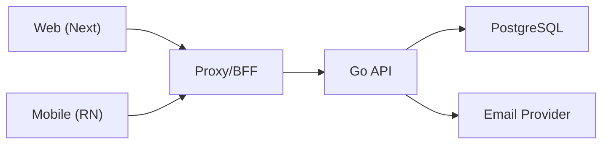
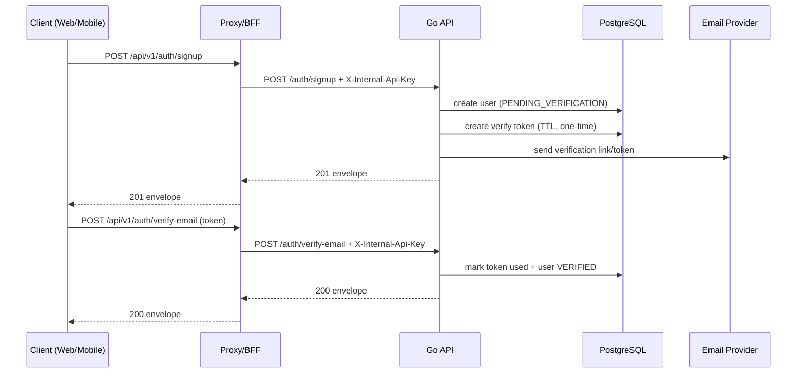
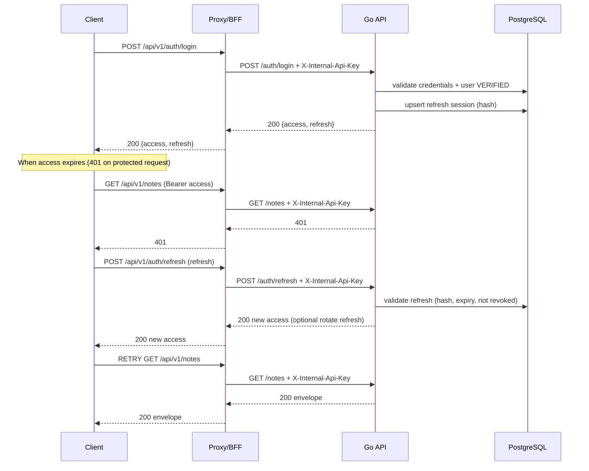
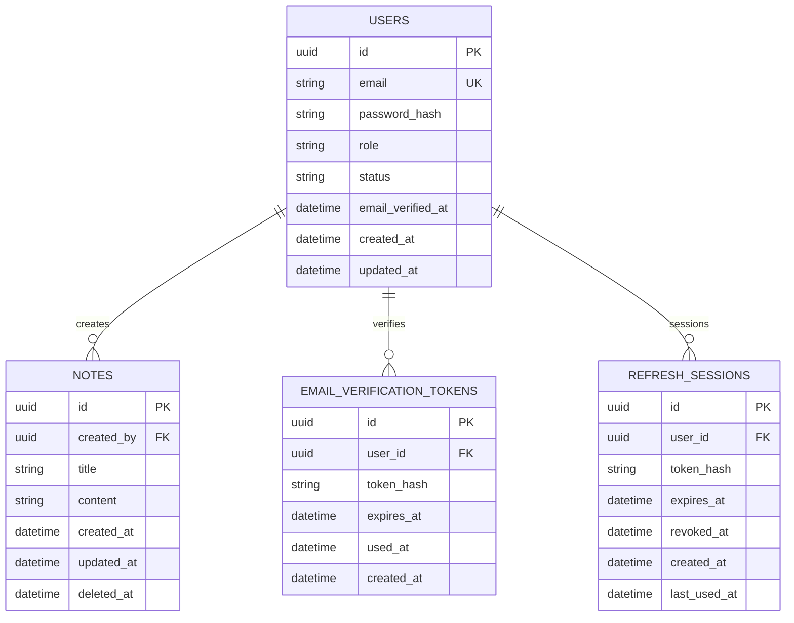
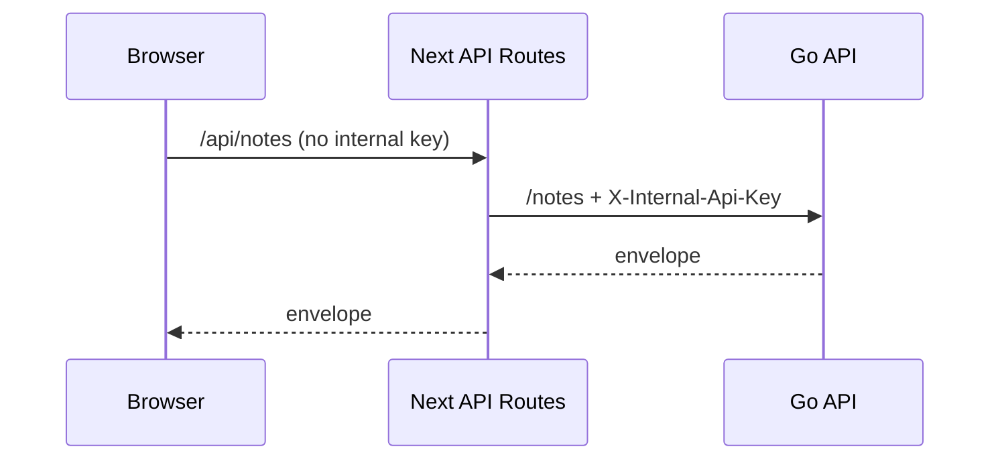
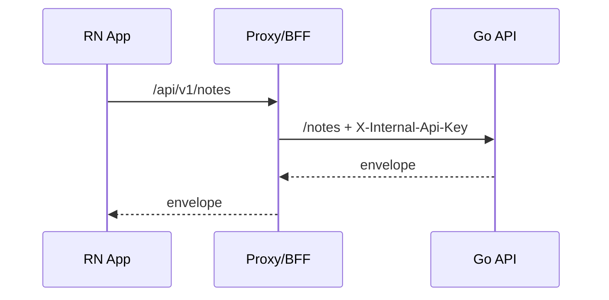

# End-to-End Solution Proposal (Go API + React Web + React Native)

**Candidate:** Irving  
**Date:** 2026-02-05

---
## 1) Scope
A minimal, operable, and extensible product:

- Auth: **signup + email verification**, **login**, **refresh**, **logout**
- Notes: **create** + **list** (cursor pagination)
- Baseline security: tokens + rate limiting + basic auditability
- Roles (RBAC): standard users (own data only) and administrative profiles (global visibility + control)
- Frontends: **Web (Next/React)** + **Mobile (React Native)** consuming the same API (via a proxy layer)
---

## 2) Monorepo layout (proposed)
```text
repo/
  apps/
    api/                # Go REST API, RBAC, DB migrations
    web/                # Next/React: UI + server-side proxy (BFF) for API calls
    mobile/             # React Native: UI + secure session storage + network-resilient UX
  packages/
    api-client/         # Shared TS client: endpoints, interceptors, pagination helpers
    contracts/          # Shared schemas/types (envelope, notes, users, pagination)
    ui/                 # Optional shared UI primitives
  infra/
    docker/             # NGINX, compose files
    ansible/            # Provision + deploy
  .github/workflows/    # CI
  README.md
```

---
## 3) Architecture (overview)
- Clients: Web and Mobile
- Proxy/BFF: centralizes API consumption, hides internal secrets, and enables compatibility/versioning
- Go API: stateless, clear internal layers
- PostgreSQL: persistence and session/token control
- Email provider: verification delivery



---
## 4) Security
### 4.1 Tokens
- **Access Token (JWT)**: short TTL (e.g., 15 min)
- **Refresh Token**: long TTL (e.g., 30 days), stored as a **hash** in DB (revocable; optional rotation)
- Recommended access token claims: `sub` (userId), `role`, `email_verified`, `exp`

### 4.2 Internal API Secret Key (client trust)
An additional layer to recognize traffic from **known clients** and reduce abuse:
- The key lives in the **Proxy/BFF** as a secret.
- The Proxy/BFF adds `X-Internal-Api-Key` only on **Proxy → Go API**.
- The Go API validates the key before processing the request.
> Equivalent alternative: API Gateway/WAF injecting/validating the header.

---
## 5) Roles and user management (RBAC)
### 5.1 Roles
- **super_admin**: full control (users + global notes)
- **admin**: operations/support (see all, moderate, disable)
- **client**: CRUD only for their own notes
- **guest**: limited read or no access (product-dependent)

### 5.2 Access rules (summary)
- Default Notes filter: `created_by = auth.userId`
- Only `admin/super_admin` can elevate scope (global/per-user)
- Admin actions are audited at minimum (`who`, `what`, `when`)
### 5.3 Permission matrix (minimum)
| Action | guest/client | admin | super_admin |
|---|---:|---:|---:|
| Create note | ✅ | ✅ | ✅ |
| View my notes | ✅ | ✅ | ✅ |
| View any user’s notes | ❌ | ✅ | ✅ |
| List users | ❌ | ✅ | ✅ |
| Change user role | ❌ | ❌ | ✅ |
| Disable user | ❌ | ✅ | ✅ |

---
## 6) API Contract (REST) – `/api/v1`
### 6.1 Auth
- `POST /auth/signup` (includes `confirmPassword` and optional `confirmEmail`)
- `POST /auth/verify-email`
- `POST /auth/login`
- `POST /auth/refresh`
- `POST /auth/logout`

### 6.2 Notes
- `POST /notes`
- `GET /notes?cursor=...&limit=20`

### 6.3 Admin
- `GET /admin/users?cursor=...&limit=50`
- `GET /admin/users/{id}`
- `PATCH /admin/users/{id}` (e.g., `status=DISABLED`)
- `PATCH /admin/users/{id}/role` (**super_admin only**)
- `GET /admin/notes?userId={id}&cursor=...`
- `GET /admin/notes/{noteId}`

---
## 6.4 Flows (diagrams)

---

### 6.4.1 Signup + email verification


### 6.4.2 Login + refresh + client retry


---

## 7.1 Data model (ERD)


## 7) API Response Standard
All responses share a common envelope. Web and Mobile rely on this contract to handle states and errors uniformly.

```json
{
  "meta": {
    "status": "success|error",
    "alertType": "info|success|warning|error",
    "message": "string",
    "timestamp": "ISO8601",
    "requestId": "req_..."
  },
  "data": {},
  "errors": [{"field":"...","issue":"..."}]
}
```

---
## 8) Web (Next/React)
### 8.1 Scope (minimum screens)
- `/signup`, `/verify-email?token=...`, `/login`
- `/notes` (list + create; cursor pagination with “load more” or infinite scroll)
- `/admin/users`, `/admin/users/{id}`, `/admin/roles` (role-gated)

### 8.2 Consumption (BFF via Next API Routes)
Principle: the browser does **not** call the Go API directly. UI calls internal routes (`/api/*`) and the BFF proxies to Go API:
- Injects `X-Internal-Api-Key`
- Manages refresh cookie lifecycle (set/rotate/clear)
- Never re-exposes internal headers to the browser


### 8.3 Session handling (proposed)
- Refresh token: **httpOnly cookie**
- Access token: memory (React state) + rehydrate via refresh on app start
- Interceptor: on `401`, attempt refresh once, then retry the original request

### 8.4 Suggested structure (web)
```text
apps/web/
  src/
    app/ (or pages/)
      (auth)/signup
      (auth)/login
      verify-email/
      notes/
      admin/
    server/
      bff/            # /api/* proxy handlers
    lib/
      auth/           # role guards, session helpers
      api/            # wraps packages/api-client
    components/
```

---

## 9) Mobile (React Native)
### 9.1 Scope (minimum screens)
- Auth: Signup, VerifyEmail, Login
- Notes: List (cursor infinite scroll), Create
- Admin (role-gated): Users list, User detail, Notes by user

### 9.2 Session and resilience
- Refresh token in **Keychain/Keystore**
- Access token in memory
- Auto refresh on `401` (single attempt per request)
- Retries with backoff on transient failures

### 9.3 Consumption
Mobile calls the same **Proxy/BFF domain** (or an equivalent gateway) so secrets remain out of the app.



### 9.4 Suggested structure (mobile)
```text
apps/mobile/
  src/
    navigation/
    screens/
      auth/
      notes/
      admin/
    services/
      api/           # wraps packages/api-client
      auth/          # refresh flow + secure storage
    storage/         # Keychain/Keystore adapters
    components/
```

---
## 10) Shared packages
- `packages/contracts`: envelope schemas/types, DTOs (User/Note), pagination types
- `packages/api-client`: TS client with interceptors (attach token, refresh+retry), cursor helpers

---
## 11) Deployment (stages)
- Stage 1: Lightsail + NGINX + Docker Compose (proxy, api, postgres)
- Stage 2: RDS/Aurora + ECS/EC2/App Runner + S3/CloudFront + Secrets Manager

---
## 12) Minimal operations
- `GET /health`, `GET /ready`
- Logs with `requestId`, status, and latency
- Minimum audit trail for admin actions (disable user, role changes)

## 👤 Autor
[](https://github.com/IrvingAA/notes-challenge#-autor)
**Irving Ayala**  
Full Stack Developer & Dev Ops Engineer